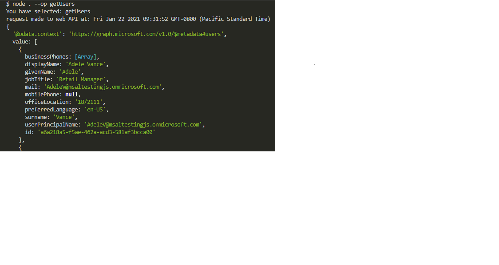

# Call the Microsoft Graph API in a Node.js console app

## Description:

You build a console app that calls Microsoft Graph API using its own identity. The console app you build uses the Microsoft Authentication Library (MSAL) for Node.js.


## Steps: 

- Register the application in the Azure portal
- Create a Node.js console app project
- Add authentication logic to your app
- Add app registration details
- Add a method to call a web API
- Test the app


### Register the application

First, complete the steps in Register an application with the Microsoft identity platform to register your app.

Use the following settings for your app registration:

- Name: NodeConsoleApp (suggested)
- Supported account types: Accounts in this organizational directory only
- API permissions: Microsoft APIs > Microsoft Graph > Application Permissions > User.Read.All
- Client secret: **** (record this value for use in a later step - it's shown only once)

### Create the project
- Start by creating a directory for this Node.js project. For example, NodeConsoleApp.

- In your terminal, change into the directory you created (the project root), and then run the following commands:

npm init -y
npm install --save dotenv yargs axios @azure/msal-node

- Next, edit the package.json file in the project root and prefix the value of main with bin/, like this: "main": "bin/index.js",

- Now create the bin directory, in powe shell terminal run the following commands:
New-Item "bin" -type Directory
cd bin

- Now create index.js, auth.js, and fetch.js files.

The index.js file you just created references two other node modules that you'll create next:
auth.js - Uses MSAL Node for acquiring access tokens from the Microsoft identity platform.
fetch.js - Requests data from the Microsoft Graph API by including access tokens (acquired in auth.js) in HTTP requests to the API.
your project's file and directory structure should look similar to this:
```
NodeConsoleApp/
├── bin
│   ├── auth.js
│   ├── fetch.js
│   ├── index.js
├── package.json
└── .env
```
Add app registration details
Create an environment file to store the app registration details that will be used when acquiring tokens. To do so, create a file named .env inside the root folder of the sample (NodeConsoleApp), and add the following code:

### Credentials
```
TENANT_ID=Enter_the_Tenant_Id_Here
CLIENT_ID=Enter_the_Application_Id_Here
CLIENT_SECRET=Enter_the_Client_Secret_Here
```
### Endpoints
```
AAD_ENDPOINT=Enter_the_Cloud_Instance_Id_Here
GRAPH_ENDPOINT=Enter_the_Graph_Endpoint_Here
```
Fill in these details with the values you obtain from Azure app registration portal:

- Enter_the_Cloud_Instance_Id_Here: The Azure cloud instance in which your application is registered.
For the main (or global) Azure cloud, enter https://login.microsoftonline.com.

- For the global Microsoft Graph API endpoint, replace both instances of this string with https://graph.microsoft.com.

### Test the app
You've completed creation of the application and are now ready to test the app's functionality.

- Start the Node.js console app by running the following command from within the root of your project folder:
```
node . --op getUsers
```
This should result in some JSON response from Microsoft Graph API and you should see an array of user objects in the console:

